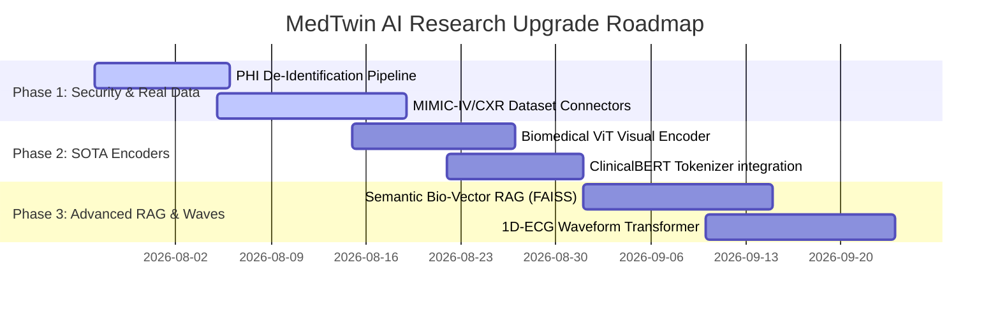

# MedTwin AI: Research Audit & Gap Analysis Report

This report presents a formal research audit of the **MedTwin AI** framework. It evaluates the current system architecture, clinical ML pipelines, and production features against state-of-the-art (SOTA) clinical AI systems (e.g., Med-PaLM M, LLaVA-Med, MIMIC-based clinical twins), identifying architectural gaps and proposing a prioritized development roadmap.

---

## 1. Project Architecture & Pipeline Audit

### 1.1 Multimodal Fusion & Medical Imaging
* **Current State**: Uses a ResNet-18 visual encoder and lateral convolution-decoders for visual branch anomalies, aligning features with notes and vitals using gated cross-attention.
* **Clinical Gap**: ResNet-18 is a general-domain vision model (ImageNet). SOTA clinical systems require visual encoders pre-trained on medical domains (e.g., **RadImageNet**, **Med3D**, or **BioViT**) to capture fine radiographic features (such as interstitial infiltrates or subtle consolidation boundaries).
* **Missing Element**: Contrastive language-image pretraining (similar to **Med-CLIP**) for zero-shot radiographic search.

### 1.2 Clinical NLP & OCR Pipeline
* **Current State**: Clinical notes are processed via a mock text projection transformer layer. Tabular lab reports are parsed via standard JSON deserialization.
* **Clinical Gap**: Real-world healthcare records are heavily unstructured (PDFs, handwritten scanned sheets). The project lacks a dedicated **Clinical OCR (Optical Character Recognition)** and layout parser (e.g., **LayoutLMv3** or clinical parser engines) to digitize unstructured lab panels.
* **Missing Element**: Integrations with real tokenizers such as **ClinicalBERT**, **BioWordVec**, or **Hugging Face BioGPT** models to handle domain-specific clinical acronyms (e.g., "COPD", "STEMI", "SIRS").

### 1.3 Clinical RAG & Knowledge Graph
* **Current State**: The Knowledge Graph is an in-memory triple-store. The RAG subsystem retrieves guidelines using a character-overlap (Jaccard similarity) keyword scorer.
* **Clinical Gap**: Medical guidelines are semantically complex. Keyword matching fails when queries use synonyms (e.g. "dyspnea" vs "shortness of breath"). SOTA systems require **Dense Vector RAG** using medical embeddings (e.g., **Bio-LinkBERT** or **BGE-Clinical**) and vector search engines (e.g. FAISS).
* **Missing Element**: Multi-hop reasoning on the Knowledge Graph (e.g., using Graph Neural Networks or recursive SPARQL) to resolve complex comorbid relationships (e.g., diabetes mellitus compounding chronic kidney disease).

### 1.4 Time-Series Wearable Processing
* **Current State**: Wearables are processed as static snapshots inside a vital dictionary.
* **Clinical Gap**: Continuous physiological monitoring (ECG waveforms, PPG signals) requires temporal encoders.
* **Missing Element**: 1D Convolutional Neural Networks (1D-CNN) or wave-transformer blocks (e.g., **ECG-ViT**) to process raw time-series data.

---

## 2. Research Methodology & Benchmarking Gaps

### 2.1 Missing Datasets
* **Current State**: Custom data is programmatically synthesized via the `PatientCraft` engine (40-70 samples).
* **Clinical Gap**: Programmatic data is excellent for unit tests and deterministic validation but lacks the out-of-distribution noise, label ambiguity, and clinical confounding factors of real-world patient files.
* **SOTA Standards**: Validation against standardized open clinical research repositories:
  - **MIMIC-IV / MIMIC-CXR**: For real chest radiographs paired with clinical notes and ICU vital logs.
  - **eICU Collaborative Research Database**: For multi-center ICU longitudinal outcomes.
  - **CheXpert**: For clinical visual scan evaluations.

### 2.2 Missing Baselines
* **Current State**: Compares consensus against a Single LLM baseline.
* **Clinical Gap**: Needs validation against clinical risk scoring calculators and standard machine learning architectures:
  - **Clinical Baselines**: Framingham Cardiovascular Risk Score, APACHE II (ICU mortality), and SOFA (sepsis-related organ failure).
  - **Tabular Baselines**: XGBoost/LightGBM trained on historical vital timelines.

---

## 3. Security, HIPAA, & Regulatory Considerations

### 3.1 HIPAA Compliance & Privacy
* **Current State**: Ingests raw patient JSON vitals and raw text clinical notes.
* **Clinical Gap**: Under HIPAA rules, Protected Health Information (PHI) must be protected. The pipeline lacks a **PHI De-identification (De-ID) pipeline** to sanitize clinical notes (removing patient names, dates, locations, phone numbers) before sending data to visual language branches.
* **Missing Element**: A regex-based or Named Entity Recognition (NER)-based de-identification module (utilizing tools like **MedaCy** or **John Snow Labs Spark NLP** models).

---

## 4. Prioritized Implementation Roadmap

Based on the audit, we outline a three-tier roadmap to elevate MedTwin AI to a publication-grade research framework:

### Phase 1: Security & Real-World Dataset Connectors (High Priority)
1. **PHI De-identification Module**: Write a sanitize filter to strip 18 HIPAA PHI identifiers from notes.
2. **Standardized Clinical Connectors**: Write data loading adapters to map MIMIC-CXR images and MIMIC-IV ICU tables directly into the `MedicalDataModule`.

### Phase 2: Domain-Specific Medical Encoders (Medium Priority)
1. **Biomedical ViT**: Swap ResNet-18 for a pretrained Bio-ViT or RadImageNet backbone.
2. **Clinical Language Models**: Integrate Hugging Face BioBERT tokenizers in `ClinicalVLM`.

### Phase 3: Advanced RAG & Waveform Encoders (Long-Term Research)
1. **Semantic Vector Search**: Replace Jaccard-overlap RAG with a dense vector database (FAISS) using PubMedBERT sentence embeddings.
2. **1D Waveform Encoder**: Add a neural block to ingest raw 1D ECG timelines.
